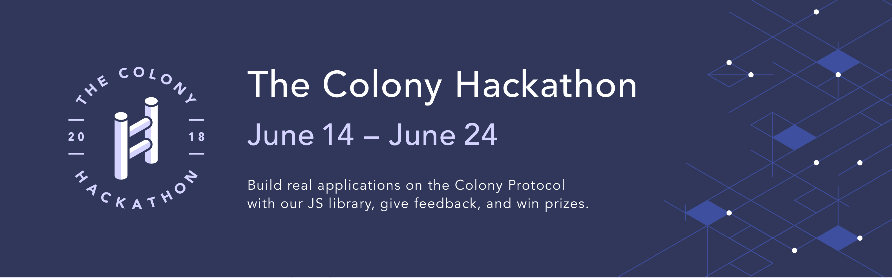

Welcome to the submission repository for the Colony Hackathon!


You can read more about the Colony Protocol from the [Docs](JoinColony.github.io)

## Dates

**June 14th**
Registration begins

**June 24th**
Submission deadline

**June 29th**
Winners Announced


## Judges and Scoring

Projects can be submitted to the following categories:


1. Design / UX
2. Front-end / dApp
3. Extensions and Integrations
4. ColonyNetwork

Within each category, submissions will be graded by the following criteria:


1. Creativity
2. Ambition / Difficulty
3. Presentation
4. Utility

Info about our super-awesome Judges panel can be found (link to judges bios)


## Prizes

**Grand Prize:**
10,000 DAI

**2nd Prize:**
5,000 DAI

**3rd Prize:**
2,000 DAI

Runners up:

3 winners: 1,000 DAI

10 winners: 500 DAI


## Gitter

To meet potential team members, chat about projects, or get help with your code and the ColonyJS library, head over to the  [gitter](https://gitter.im/ColonyHackathon/Lobby)

# Submission Guidelines

Participating in the hackathon is as easy as contributing to a GitHub repo. Exactly so, because you will register your project by creating an issue in this repository, and submit it by creating a pull request!

Here’s how it works:

## The Submission Process

### 0) Create an issue
Your first step is to create an issue in the `colonyHackathon` repository. This issue acts as a "soft" registration for the hackathon, and can help you to coordinate your ideas with other participants. An issue is a good place to talk openly about your project ideas with others before you decide on its exact scope.

Use your issue to talk with collaborators, brainstorm, and organize. Check out the other issues to see if there are participants who want to work on the same things.

Members of the colony team will be able to point other participants to your issue (if it looks like they can help), help you with technical questions, or just offer support :)

Issue events will also be pulled into the Gitter feed [Gitter](https://gitter.im/ColonyHackathon/Lobby).

### 1) Create a new branch for your project; open a Pull Request
When you decide to get going, you should create a new branch for your team to work in, and push it to this repository.

Please name your branch appropriately: `project/my_cool_project`

```bash
~$ git checkout -b project/exampleProject

~$ git push -u origin project/exampleProject
```

Once your new branch has been created in the upstream repository, you're ready to open a PR.

*Opening a Pull Request establishes your project as an "official" submission*

By opening a PR with your project's branch will, in essence, 'lock in' your project.

Don't worry, you're still free to completely change things around! Once you open a PR, however, that branch will be the home of your project.

You and your team are free to continue working/changing from the branch, and may want to use the PR for more project-specific comments and coordination.

We'd recommend closing the issue you created in step 0 [using keywords](https://help.github.com/articles/closing-issues-using-keywords/), so that followers of the issue will be notified that you're up and running.

### 2) Build with Colony
Over the course of the Hackathon, build your project and get it ready for the submission deadline: *June 24, 17:00 GMT*

Whatever state your project is in by the deadline will be what gets submitted. At that time, all open PRs will be merged into the master branch for evaluation (provided they don't mess with anyone else's project ;). Any issues linked to open PRs will be closed.

After the global merge, you're free to keep working, but any subsequent commits to your branch won't be evaluated by the judges.

### 3) Congratulate your team (and yourself) on a job well-done
Whether or not you get a prize, you deserve to be proud of your work. Thanks for participating in the hackathon!
