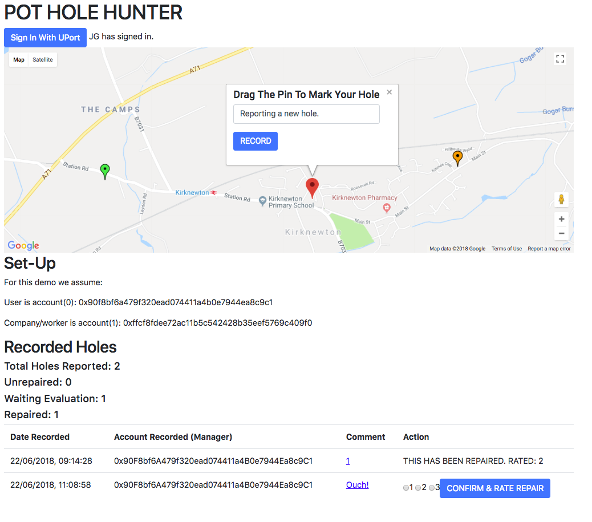
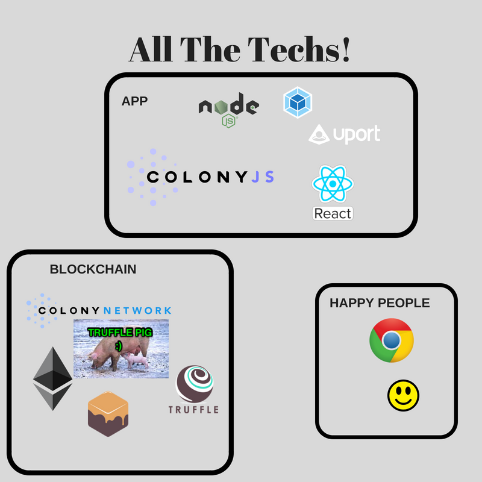

# Decentralised Issue Reporting - Pot(Hole) Hunting

## Description
Service issues and how these are handled provide a strong indicator of how a company/operator/authority performs and the standard of the service. Potential clients/customers use this kind information when making the decision to sign-up. Companies, or at least well run companies, can use it to drive continuous improvement and provide a stronger product.

At the moment if an operator even runs a trouble reporting system it will normally be centrally controlled by the operator itself. This means they control the data and the visibility of that data. Ultimately it means there is no real reliable accountability. Reported data can be inaccurate. Unwanted information can be hidden or even deleted.

Plenty of anecdotal examples exist showing where a companies official support path fails and action is only taken by the operator once a user reports their issue on a public forum like Facebook or Twitter - a platform the company doesn't control and where they can be held publicly accountable.

This app demonstrates how Colony can be used to create a decentralised issue system. Operators no longer own their issue data because an immutable record of it is kept on the Blockchain. Colony's built in rating and reputation system allows the quality of response to an issue to be assessed and the reputation system keeps both the public users and the operator itself honest. Reports can show interested parties a reliable and accurate summary of how the operator is performing. Cryptocurrency payments can be implemented along with competitive bidding systems that allow operators or anyone with an issue to offer bounties for work that only get paid out when the work is completed to a acceptable standard.

The app itself is focused on a very niche area - pot hole reporting for a local authority! A full version would build on this and allow any company/operator/authority to be added with their own sub-set of issues.

As well as complaining about the weather people in the UK love a good moan about pot holes so I thought it would be a good place to start. They are actually a pretty serious issue, causing damage to vehicles and costing money to repair, especially if they are left to get worse. As far as I'm aware the local councils (who I assume are responsible for repairs) don't release any kind of statistics or information on what holes have been reported or repaired. There is  also no way to confirm that any information they did release about repairs is accurate or even true because there's no way to verify it. Without this kind of information we can't evaluate how the council performs and having the ability to 'crowd source' pot hole reporting and repair quality could help reduce the overall repair costs by identifying trouble areas more efficiently.

An interesting near future use case for this specific area is the possibility to combine the issue reporting with drone repair technology. A number of companies are working on autonomous drones that locate and repair potholes/damaged roads using mobile tarmac 3D print technology (I promise this is true :) ). Using a Colony based app drones can assume the role of workers, autonomously scanning the Colony task list for suitable repairs to make, carrying out the repairs and automatically marking the job as complete to be rated by the public. Surely that's all the hot topics - drones, 3D printing, IoT, blockchain and of course, pot holes!



## How The App Works

#### Interface:

Holes can be recorded by clicking the location on the map.

Recorded holes are displayed on the map and also in the hole list table. Holes in the table show the status which can be:
1. Waiting Repair - Hole has been reported but the Company has not yet fixed it
2. Repaired Awaiting Confirmation & Evaluation - Company has marked the hole as repaired. The repair now needs confirmed & quality of fix rated by an evaluator
3. Confirmed - Hole repair has been evaluated. Rating shown for historic reporting

The status is also reflected in the map icon colour.

#### Accounts:

A 'User' needs an account to record holes or to evaluate repaired holes. In this case we default to account 0.

In this demo there is only one 'Company', it is account 1. In the future this could be claimed by a verification process such as UPort (see below).

#### Colony:

On the first use a Pot Hole Hunters Colony is created with its own PHH token.

#### Record Hole:

User records a pothole location by clicking it's position on the map. Additional comment can be added. Then Record is clicked.

The pothole location & comment information is saved to IPFS which produces a spec hash for the task.

A Task is added to the PHH Colony Network. The tasks hash is the hash returned from IPFS. The Manager is the user account who recorded it.

Once the Task is created the Worker role is automatically assigned as the Company Account using the multisig operation.

Task Manager & Worker payout is set to 1PHH. In this app I was trying to focus only on reputation but I didn't manage to figure out that part in time.

#### Update Hole:

A hole needs updated when the status is changed.

The new info is saved to IPFS and the new spec hash is saved.

The Colony task brief is updated with the new spec hash using the multisig operation.

If the hole is marked as repaired the task deliverable is submitted with the new IPFS hash.

If the hold is marked as confirmed WORKER rating is submitted. The task is finalised.

#### Getting Hole Info:

To display recorded task information on the GUI the information is retreived from Colony/IPFS.

All spec hashes for tasks in the PHH colony are retreived using the getTask call.

Using the spec hash the hole information is retrieved from IPFS.

The Manager role for the task is also retrieved to show who recorded the hole.

#### uPort Integration:

At the moment there is only very basic uPort integration. When a user clicks Sign In at the top left and authenticates with the uPort app the user name is displayed. I didn't have time to figure out how to reference the rinkeby account details to my Ganache accounts to then interact with Colony, etc.

In the future using uPort seems like a nice way to authenticate users for reporting/evaluating holes and getting company/worker info and from initial work the uPort system is nice to work with.



## Issue

This closes the issue #97 Decentralised Issue Reporting - Pot(Hole) Hunting

## Repository

Code at: https://github.com/johngrantuk/colonyHackathon.git

## Running Project

Clone project: ```git clone https://github.com/johngrantuk/colonyHackathon.git```

```cd colonyHackathon```

Then: ```npm install```

Then: ```npm start```

Make sure the local Colony test network is running. All from the local Colony contract folder:

Run Ganache: ```ganache-cli -d --gasLimit 7000000 --acctKeys ganache-accounts.json --noVMErrorsOnRPCResponse```

Deploy Colony contracts:
```./node_modules/.bin/truffle migrate --compile-all —reset```

Start Truggle Pig:
``` trufflepig --ganacheKeyFile ganache-accounts.json```

## Team Members and Contact info

John: @johngrantuk on github, johngrantuk@googlemail.com

## Additional Materials

Here's my [demo video](https://youtu.be/_V_vWxrxdo0).

[Medium post](https://medium.com/@johngrant/ethereum-development-colony-hackathon-consenys-academy-react-8fc845ea47f1).
