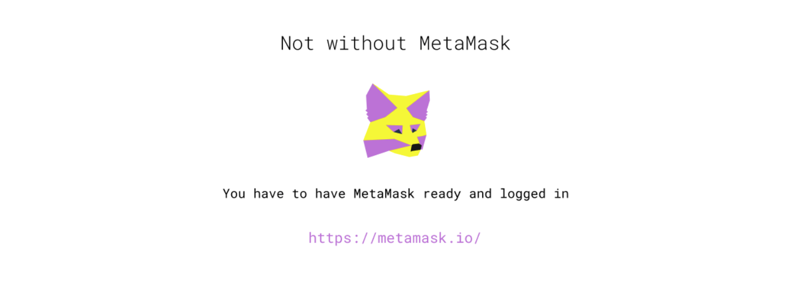

## What is Kyodo

Kyodo - is an attempt to create an ecosystem of applications, communities and tools to help decentralised teams to govern, cooperate, learn, collaborate, recognise each others contributions in horizontal manner and hopefully flourish. This is just the beginning.

### Issue

This closes the issue https://github.com/JoinColony/colonyHackathon/issues/48

### Repository

Frontend https://github.com/decentfund/kyodo

Backend https://github.com/decentfund/kyodo-backend

Bot https://github.com/decentfund/kyodo-bot

Contracts https://github.com/decentfund/colonyNetwork

### Final Commit

The one and only:

https://github.com/decentfund/kyodo/commit/4774e4594567812e1f560bef5bc90e8305df0ae2

### Team

The project was built with contributions from:

* Igor (@igorline on GitHub,
  [igor@decent.fund](mailto:igor@decent.fund))
* Nastya (@nastyaparygina on Medium,
  [nastya@decent.fund](mailto:nastya@decent.fund))
* Roma (@romochka on Github, [voronezhskiy@decent.fund](mailto:voronezhskiy@decent.fund))
* Nikita (@palevoo on Github,
  [kud.nikita@gmail.com.fund](mailto:kud.nikita@gmail.com))

---

## Additional Materials

Medium Article – more in depth about the concept <https://medium.com/p/385515ef03a7/edit>

